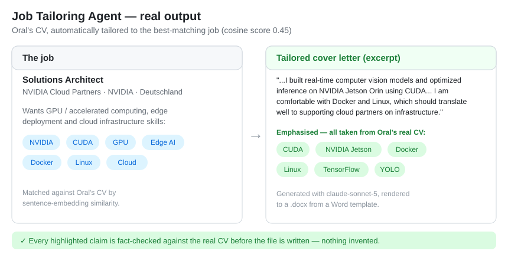
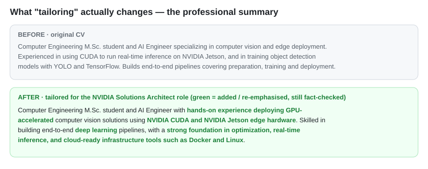

# Job Tailoring Agent

Scrapes job postings, embeds them into a pgvector database, matches them against
your CV by semantic similarity, and uses an LLM to generate a **tailored CV** and
**cover letter** for the best matches — each one fact-checked against your real CV
before it is written to disk.

## Architecture

```
                 ┌──────────────┐      ┌──────────────┐
   Adzuna  ─────▶│              │      │              │
                 │  Scrapers    │─────▶│  Postgres +  │
   Remotive ────▶│ (BaseScraper)│ save │   pgvector   │
                 └──────────────┘      └──────┬───────┘
                                              │ embeddings
                        CV (pdf) ──▶ convert ─┤ (sentence-transformers)
                                              ▼
                                       ┌──────────────┐
                                       │   Matcher    │  cosine similarity
                                       │  (cv_match)  │
                                       └──────┬───────┘
                                              │ top-k jobs
                                              ▼
                       ┌───────────────────────────────────────┐
                       │              Tailor                    │
                       │  tailor_cv ─▶ evaluate ─▶ cover_letter │
                       │       │           │            │       │
                       │       ▼           ▼            ▼       │
                       │     LLM      coverage +      render    │
                       │  (llm.py)    LLM judge      (docxtpl)  │
                       └───────────────────┬───────────────────┘
                                           ▼
                                   output/*.docx  (▶ pdf on demand)

        Exposed over FastAPI:  /jobs  /tailor/{id}  /tailor/{id}/status  /download/{id}
```

### Layers

| Module | Responsibility |
|---|---|
| `src/config.py` | Single source of truth for all settings (URLs, models, thresholds). |
| `src/scraper/base.py` | `BaseScraper` — shared search/country/limit params, retrying HTTP, normalize loop. |
| `src/scraper/adzuna.py`, `remotive.py` | Source-specific request + field mapping. |
| `src/db/` | SQLAlchemy models, engine, pgvector setup, dedup insert. |
| `src/embedding.py`, `src/matcher.py` | Vectorize jobs/CV and rank by cosine similarity. |
| `src/llm.py` | Provider-agnostic LLM calls (Anthropic / OpenAI / Ollama) with retry. |
| `src/tailor.py` | Turn a CV + job into tailored CV / cover-letter JSON, then render `.docx`. |
| `src/evaluator.py` | Quality gate: keyword coverage + strict LLM fact-checker. |
| `src/export.py` | On-demand `.docx → .pdf` via headless LibreOffice. |
| `src/api/` | FastAPI app, DB dependency, background tasks, response schemas. |

## Requirements

- Python 3.11+
- Docker (for Postgres + pgvector, and optionally the app)
- An LLM API key (Anthropic by default) and Adzuna API credentials

## Setup (local app, DB in Docker)

```bash
# 1. Start the database
docker compose up -d db

# 2. Configure environment
cp .env.example .env      # fill in ANTHROPIC_API_KEY, ADZUNA_APP_ID/KEY

# 3. Install deps
python -m venv .venv && . .venv/Scripts/activate   # Windows: .venv\Scripts\activate
pip install -r requirements.txt

# 4. Run the API
uvicorn src.api.app:app --reload
```

Open http://localhost:8000/docs for the interactive Swagger UI.

Place the CV you want to tailor at `data/cv.pdf` (or point `DEFAULT_CV_PATH` elsewhere).

### One-shot CLI pipeline

```bash
python -m src.main    # ingest → embed → tailor top 3 matches into output/
```

## Setup (everything in Docker)

```bash
cp .env.example .env    # fill in keys
docker compose up --build
```

The `app` service reaches the DB at `db:5432` on the compose network, waits for
the DB healthcheck before starting, and can reach host services (e.g. a local
Ollama) via `host.docker.internal`.

## API

The easiest way to explore the API is the auto-generated Swagger UI at
http://localhost:8000/docs — every endpoint has a "Try it out" button.

| Method | Path | Description |
|---|---|---|
| `POST` | `/ingest?search=&country=&limit=` | Fetch + embed jobs for a search term (background). This is how jobs get into the DB. |
| `GET`  | `/jobs?limit=&offset=&source=&location=&remote=` | List stored jobs with optional filters. |
| `POST` | `/tailor/{job_id}` | Queue tailoring as a background task → `202`. |
| `GET`  | `/tailor/{job_id}/status` | Poll status: `pending`/`running`/`done`/`failed`. |
| `GET`  | `/download/{job_id}?doc=cv\|cover_letter&format=docx\|pdf` | Download a generated document. |
| `GET`  | `/health` | Liveness probe. |

### Query parameters

- `/jobs` — `source` (`adzuna`/`remotive`), `location` (substring, e.g. `Berlin`),
  `remote` (`true` = only remote jobs), plus `limit`/`offset` for paging.
- `/ingest` — `search` (e.g. `python backend`), `country` (Adzuna code, e.g. `de`),
  `limit` (per source). Omitted values fall back to `src/config.py` defaults.

Typical flow:

```bash
# 1. Pull jobs for the search you care about
curl -X POST "localhost:8000/ingest?search=python%20backend&country=de"

# 2. Browse them (only remote jobs in Berlin)
curl "localhost:8000/jobs?location=Berlin&remote=true"

# 3. Tailor the one you picked, poll, download
curl -X POST localhost:8000/tailor/12
curl localhost:8000/tailor/12/status
curl -OJ "localhost:8000/download/12?doc=cover_letter&format=pdf"
```

## Testing

```bash
pytest                       # fast unit tests (LLM + network mocked)
RUN_DB_TESTS=1 pytest        # also run DB integration tests (needs a live DB_URL)
```

## Configuration

Everything tunable lives in `src/config.py` and is overridable via env/.env:
search query, country, results-per-page, model name, coverage threshold,
default CV path, retry count. Change behaviour in one place, not scattered
through the code.

## Demo

A real run: the agent matched a CV against the scraped jobs, picked the
best-fitting one (an NVIDIA Solutions Architect role) by embedding similarity,
and generated a cover letter and CV tailored to it with `claude-sonnet-5`.



Tailoring rewrites the content to foreground what the job asks for. Green marks
what was added or re-emphasised — every phrase is still drawn from, and
fact-checked against, the real CV:



## Future works

- **Web front-end.** Today the only interface is the auto-generated Swagger UI
  at `/docs`. A small React (or plain HTML/JS) site would let a user browse
  jobs, click "tailor", watch progress, and download — all without touching the
  raw API. The backend is already API-first, so this is additive.
- **Per-user isolation.** Tailoring status is keyed by job id in memory; a
  multi-user site needs per-user task ids (UUID) and auth so two people can
  tailor the same job without colliding.
- **Multi-country ingest.** `/ingest` fetches one Adzuna country per call;
  accept a list (`countries=uk,de,fr`) to pull several at once.
- **Reranking / self-correction.** Re-rank matches with an LLM, or retry
  generation when the fact-check fails instead of rejecting outright.
